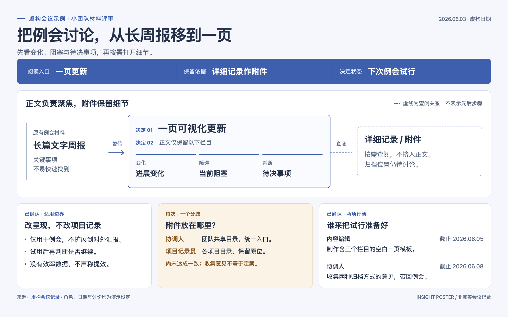

# Insight Poster

把“读完一份文档”变成“看懂一件事”。

核心只有一份 [SKILL.md](SKILL.md)：它是一份给 AI coding agent 阅读的工作指南，约束信息提炼、图文组织、配色和成品检查，让 agent 把长文档做成便于扫读的**单页 HTML 信息海报**。不是 Markdown 分卡器，也不限于学术会议海报。

**English:** A lightweight, single-file skill for turning papers, meeting notes, research reviews, and other documents into readable, self-contained HTML posters. It guides a coding agent's information design; it is not a rendering framework or service.

**它不是一个独立运行的软件。** 不需要为本项目安装 npm / Python 依赖，也没有要启动的服务；你需要一个能读取材料、编写 HTML 文件的 AI agent。浏览器检查与 PDF 解析等能力由所用 agent 和工具提供。

## 适合什么材料

| 输入 | 海报优先传达什么 |
| --- | --- |
| 论文、技术报告 | 核心问题、方法、关键证据和适用边界 |
| 会议纪要、讨论记录 | 已定事项、尚存分歧、负责人及后续行动 |
| 调研总结、综述、选型材料 | 方向分类、方案差异、选择依据和证据缺口 |
| 思路总结、方案、复盘 | 问题结构、方案关系、经验和待验证假设 |

材料可以是 Markdown、文本、PDF，或直接粘贴的内容。文件格式是否能被读取取决于 agent；无法解析的扫描 PDF 需要先提供可读文本或清晰图片。没有数据的材料也能使用，不会要求你凑数字或实验结果。

## 看一个例子



[查看示例 HTML 源文件](examples/meeting-summary.html) · [阅读虚构会议输入](examples/meeting-notes.txt)

下载后在浏览器打开 HTML，即可体验页面操作；GitHub 文件页展示的是源码。示例输入明确为虚构，不来自真实会议或私人对话。它展示一种材料的处理方式，**不是适用于所有材料的质量基准**；不同 agent、系统字体和浏览器可能产生不同的内容取舍与排版。

此示例采用 1920 × 1200 画布，对应 508 × 317.5mm 单页打印。skill 的默认值为 1920 × 1320，但允许按内容调整比例；打印尺寸须跟随实际画布换算。

## 它强调什么

- **先理解，再排版**：围绕读者应带走的主张组织内容，不照搬原文目录。
- **上方抓重点，下方有顺序**：标题与一句话主张 → 关键理解条 → 上半部核心视觉；下方沿统一网格安排证据、解释、边界或行动。
- **图形表达真实关系**：有比较才做对照，有时序才画时间线；无数据不硬凑 KPI，不编造数字、责任人、期限或结论。
- **保留必要限定**：区分事实、主张、建议、已定事项与待决问题；不能为了好看省略分歧和边界。
- **配色有理由**：根据内容或品牌选择冷静技术、温暖编辑、清晰决策等气质；保持语义同色，不给每张卡片随机上色。
- **交付轻量**：核心只是一份指令文件，无框架、包依赖、CI 或专用渲染服务。

## 快速上手

### 1. 获取 skill

从集中维护的 [skills 仓库](https://github.com/N0TPO3T/skills) 下载 ZIP 并解压，或克隆；本组件位于 [insight-poster/](https://github.com/N0TPO3T/skills/tree/main/insight-poster)。推荐从仓库根目录安装：

```sh
git clone https://github.com/N0TPO3T/skills.git
cd skills
python install.py insight-poster
cd insight-poster
```

安装器默认复制到 `~/.agents/skills`，可用 `--dest <skills-root>` 指定宿主的技能根目录，不覆盖已有目录。宿主的识别与启用方式见其官方文档及[根 README 安装说明](../README.md)；复制文件不代表自动注册，也不会增加宿主工具能力。

上述最后一步进入的是 `skills/insight-poster` 组件目录。在这个目录中启动你的 coding agent，或让已有会话读取这个目录中的文件。

如果只想使用核心规则，也可以只下载 [SKILL.md](https://raw.githubusercontent.com/N0TPO3T/skills/main/insight-poster/SKILL.md)，无需复制示例。

### 2. 先用仓库示例跑一遍

克隆或下载完整仓库后，从 `skills/insight-poster` 组件目录（ZIP 解压后为 `<解压目录>/insight-poster`）操作，将下面这段提示词发给 agent：

```text
请先阅读并遵循 SKILL.md，再读取 examples/meeting-notes.txt。
面向未参会的协作成员，制作一张中文单页信息海报：
突出已定事项、尚有分歧的问题，以及有明确依据的后续行动。
保留虚构示例标识，不补造数字、责任人或期限。
输出为 meeting-poster.html，只交付这一个可离线打开的 HTML。
如果有浏览器工具，请打开成品检查适应窗口、原尺寸和打印效果；
没有实际检查的部分，请明确说明。
```

若只下载了 `SKILL.md`，请跳过仓库示例，直接提供自己的材料。以下所有示例的相对路径均以 `insight-poster` 组件目录为基准；agent 不在该目录中时，提示词里的相对路径需要换成它实际能访问的路径。

### 3. 打开和调整成品

在浏览器中打开生成的 `meeting-poster.html`，无需启动本地服务器：

- **适应窗口**：查看整体信息结构。
- **原尺寸**：阅读细节；小窗口下可以滚动。
- **打印 / 保存 PDF**：打开浏览器打印对话框，选择保存为 PDF。检查预览是否为单页，是否保留背景色，以及自定义纸张是否被浏览器采用。

不满意时，直接要求 agent 修改同一个 HTML，例如：

```text
保留顶部主张与核心关系图。
下半部分合并为“已定事项、待决问题、后续行动”三个对齐的区域，
删除与顶部重复的句子，改用暖白与赭红配色。
不要添加原文没有的内容，修改后重新检查显示。
```

## 用自己的材料

把下面的输入文件名换成实际材料路径。一般只需要说明**材料、读者、用途**，其余交给 skill；有语言、品牌色或纸张要求时再补充。

### 论文解读

```text
先阅读并遵循 SKILL.md，再阅读 paper.pdf。
面向有相关背景的研究者，制作中文单页 HTML 海报。
上方突出核心方法和关键结果，下方解释证据与局限。
只依据这篇论文，保留指标单位、基线和实验条件。
输出 paper-poster.html。
```

### 调研与方案比较

```text
先阅读并遵循 SKILL.md，再阅读 research.md。
面向正在选型的团队，把主要方案、差异和选择依据做成单页 HTML。
用有依据的比较结构表达，不补造评分；信息不足的地方明确标注。
输出 research-poster.html。
```

### 思路总结与复盘

```text
先阅读并遵循 SKILL.md，再整理下面粘贴的内容。
面向参与讨论的同事，做一张帮助理解问题和方案关系的信息海报。
区分已经确认的事实与尚待验证的想法，不把建议写成决定。
输出 ideas-poster.html。
材料：
（在这里粘贴你的内容）
```

## 输出与运行边界

- 默认只输出**一个离线 HTML**：内联样式、必要的 SVG/脚本和图片，使用系统字体；不依赖 CDN、远程字体或网络请求。
- 页面提供“**适应窗口 / 原尺寸**”与“**打印 / 保存 PDF**”操作。默认固定横向画布、整体等比缩放；小屏不是另做一套移动端布局。
- 默认不附带策划稿、配置文件、多版本、PNG 或 PDF。需要额外导出时再明确提出；仓库截图是公开演示材料，不代表每次生成都会附带截图。
- skill 本身不指定模型，也不负责调用外部模型、解析 PDF 或维护渲染引擎。**源文件读取、PDF 解析与图像提取、HTML 生成、浏览器渲染及可选导出，均取决于所用 agent 的能力和可用工具。**
- 没有浏览器工具时只能进行可用的结构检查，视觉效果应标为未验证；没有实际检查打印或导出的 PDF，也不能声称其分页、裁切已通过检查。
- 海报是原始材料的阅读入口，不替代完整记录。生成内容与重要数据仍需核对，打印结果也受浏览器和纸张设置影响。

## 隐私与公开分享

“离线 HTML”指成品无需联网展示，**不代表 agent 处理材料时一定在本地运行**；提交敏感材料前请了解所用工具的数据政策。

默认不得把完整原文、私人对话、本机绝对路径或敏感信息藏入 HTML 注释、脚本或元数据。公开分享前检查可见与隐藏内容，未经明确授权不上传原始材料或生成物。本仓库的公开会议示例为虚构内容，不包含真实会议信息。

## 来源、贡献与许可

流程借鉴 [Paper2Poster 官方轻量 skill](https://github.com/Paper2Poster/Paper2Poster/blob/424809d4bf041b26cd9dc1efc660ba559bee2f3c/skills/SKILL.md) 的源文优先、文案压缩、主图优先与质量检查原则；固定版本引用也保留在 [SKILL.md](SKILL.md) 中。本项目**不依赖或调用 PosterAgent 后端**，不复现其完整流水线，也不宣称性能或质量优于其他工具。

欢迎通过提交和 Pull Request 改进 `SKILL.md` 或示例，说明希望改善的实际使用问题即可；请勿提交未经授权的真实材料。

采用 [MIT License](LICENSE)。
