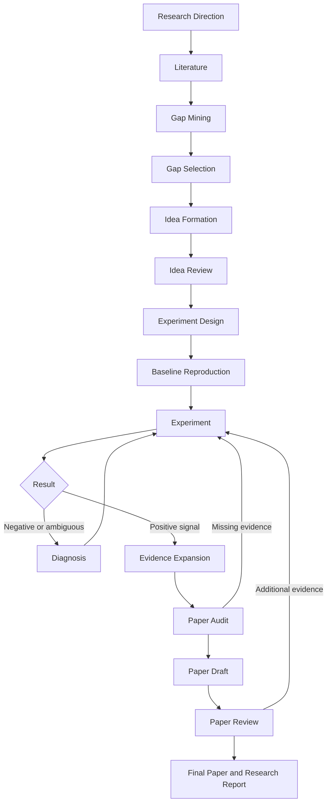

# Research Agent

[](https://github.com/N0TPO3T/research-agent/actions/workflows/ci.yml)
[](https://github.com/N0TPO3T/research-agent/releases)
[](pyproject.toml)
[](LICENSE)
[](https://agentskills.io/specification)

An Agent Skill and optional Python runtime for end-to-end machine-learning
research.

Starting from a broad research direction, Research Agent organizes literature
review, research-gap discovery, idea attack and defense, resource-aware
experiment design, iterative diagnosis, evidence expansion, and paper drafting
into one persistent research loop.

It is **not an automatic paper generator** and does not guarantee a positive or
publishable result. Its central loop is:

```text
Evidence -> Hypothesis -> Experiment -> Diagnosis -> Updated Evidence
```

## Why this project exists

Research work is usually fragmented across search results, notes, idea
discussions, experiment repositories, debugging sessions, and manuscript
drafts. That fragmentation makes it easy to lose provenance, confuse an
unexecuted plan with evidence, or continue a weak direction because the earlier
decision trail disappeared.

Research Agent packages a scientific operating procedure as a portable
[Agent Skill](skills/research-agent/SKILL.md). The optional runtime adds typed
state, project resumption, a CLI, artifact boundaries, mock fixtures, and a live
Codex-oriented host integration.

## Two ways to use Research Agent

| Capability | Skill only | Full runtime |
| --- | ---: | ---: |
| Research SOP | yes | yes |
| Progressive phase prompts | yes | yes |
| Literature reasoning | host-dependent | yes |
| Persistent `ResearchState` | host-dependent | yes |
| CLI | — | yes |
| Mock mode | — | yes |
| Live Codex integration | — | yes |
| Experiment artifact persistence | host-dependent | yes |
| Resume projects | host-dependent | yes |

**Portable Skill:** install only `skills/research-agent/`. The host Agent
provides search, paper-reading, filesystem, coding, shell, and persistence
capabilities. Tool availability and automatic discovery differ by host.

**Optional Full Runtime:** install the Python package to add the
`research-agent` CLI, typed local state, deterministic mock workflows,
literature provenance, checkpoint resumption, experiment ledgers, and the
current Codex live backend. The Skill remains usable without this package.

## Main capabilities

- Literature research and provenance-aware verification
- Research-gap discovery and cross-paper limitation synthesis
- Hypothesis formation, novelty checks, and idea attack/defense
- Resource-aware experiment design and baseline reproduction gates
- Experiment diagnosis, stopping rules, and pivot decisions
- Evidence expansion, paper-readiness audit, drafting, and review
- Persistent checkpoints, experiment records, and research reports

## Workflow



### Human checkpoints

1. **Checkpoint A — Topic Selection:** the Agent presents 3–5 candidate
   research GAPs and the researcher selects one.
2. **Checkpoint B — Idea + Resources:** the researcher may supply an idea, ask
   the Agent to propose one, and records compute, time, model, and execution
   constraints.
3. **Checkpoint C — Major Pivot:** the Agent asks again only when the research
   direction itself needs a major change.

Ordinary literature search, experiment diagnosis, and small method revisions
proceed without creating new human checkpoints. A checkpoint response does not
implicitly grant shell, repository, network, or external-system permissions.

| Phase | Purpose |
| --- | --- |
| Bootstrap | Turn a broad direction into a research scope |
| Horizon Scan | Build the literature landscape |
| Gap Mining | Find recurring limitations and root causes |
| Gap Synthesis | Produce 3–5 candidate GAPs |
| Idea Formation | Turn the selected GAP into falsifiable hypotheses |
| Idea Review | Attack, defend, and refine the idea |
| Resource Design | Plan experiments within actual constraints |
| Baseline Reproduction | Verify the strongest relevant baseline |
| Experiment Loop | Run minimum viable and core experiments |
| Diagnosis / Pivot | Diagnose failures and update the direction |
| Evidence Expansion | Add necessary robustness and ablations |
| Paper Audit | Check whether claims are supported |
| Paper Assembly | Draft from verified evidence |
| Paper Review | Critique and return to experiments when needed |

See [Workflow](docs/WORKFLOW.md) for the four nested loops and decision rules.

## Install the portable Skill only

### Codex with `skill-installer`

Ask Codex:

```text
Install the research-agent skill from:
https://github.com/N0TPO3T/research-agent/tree/main/skills/research-agent
```

Restart or refresh the Agent session after installation.

### Manual Codex installation

```bash
git clone https://github.com/N0TPO3T/research-agent.git
mkdir -p "${CODEX_HOME:-$HOME/.codex}/skills"
cp -R research-agent/skills/research-agent \
  "${CODEX_HOME:-$HOME/.codex}/skills/research-agent"
```

The GitHub release also provides `research-agent-skill-0.2.0.zip`. Its archive
root is the installable `research-agent/` directory, so it can be extracted
directly into a compatible host's skills directory.

### Other Agent Skills-compatible hosts

The directory follows the open
[Agent Skills specification](https://agentskills.io/specification). Copy,
import, or point the host's skill loader at `skills/research-agent/`, following
that host's installation instructions. Tool availability, persistence, and
automatic discovery are host-specific; cross-host behavior is not guaranteed
to be identical.

## Skill-only examples

```text
Use the research-agent skill.

I want to study efficient inference-time reasoning for large language models.
```

```text
Use the research-agent skill.

I want to study RLVR. My current idea is ...
```

```text
Continue my research project using the research-agent skill.
```

The Skill progressively loads global scientific rules, the current loop, the
current phase prompt, and an active checkpoint prompt. It does not load the
archived full SOP on every turn.

## Install the optional full runtime

The runtime requires Python 3.11 or newer.

### With `uv`

```bash
git clone https://github.com/N0TPO3T/research-agent.git
cd research-agent
uv sync --extra dev
source .venv/bin/activate
```

### With `pip`

```bash
git clone https://github.com/N0TPO3T/research-agent.git
cd research-agent
python3 -m venv .venv
source .venv/bin/activate
python -m pip install .
```

You may also install the wheel attached to the GitHub release. The package is
not published to PyPI.

## Runtime quick start

```bash
research-agent init my_project \
  --direction "adaptive test-time compute for LLM reasoning"

research-agent doctor my_project

research-agent run my_project --live --dry-run
research-agent run my_project --live
```

The live backend expects an installed and authenticated `codex` command. The
dry run reports the phase, progressively loaded Skill resources, relevant
context, available capabilities, and planned high-level action without invoking
the host or executing an experiment.

At Checkpoint A, resume with the selected GAP ID:

```bash
research-agent resume my_project GAP-ID --live
```

At Checkpoint B, pass `default` or a JSON object matching the displayed
resource schema. Before baseline or experiment work, attach a repository when
the workflow requests one:

```bash
research-agent attach-repo my_project /path/to/baseline
```

To inspect a deterministic synthetic workflow without web, host-model, GPU, or
shell calls:

```bash
research-agent init demo --direction "long-context reasoning" --mock
research-agent run demo --mock
research-agent status demo
```

Project data is stored under `./projects` by default. Use the global
`--projects-root` option or `RESEARCH_AGENT_PROJECTS_ROOT` to select another
location. See [Runtime](docs/RUNTIME.md) for architecture, configuration, and
the persistence contract.

## Scientific integrity

- Never fabricate papers, citations, or experimental results.
- Unexecuted experiments are plans, not evidence.
- Negative results are retained.
- Observation and interpretation are stored separately.
- Novelty claims are bounded by the literature actually searched.
- Major pivots are recorded.
- Paper claims must match their supporting evidence.
- Retrieval is not verification; abstract-level evidence cannot support
  detailed method, ablation, or failure-mode claims.

## Execution safety

Shell execution is disabled by default. In the full runtime, both the attached
repository's `execution.allow_shell` setting and the project's
`ResourceConstraints.shell_execution_allowed` must be true before a command can
run. Attaching a repository alone does not grant execution permission.

The runtime does not bypass paywalls, authentication, or robots policy. A host
model's prose cannot create an experimental result: only runner-produced
artifacts can be admitted as executed evidence. Commands, logs, credentials,
downloaded papers, and project state belong in ignored project/artifact paths,
not in this repository.

## Repository layout

```text
.
├── skills/research-agent/       # canonical portable Skill source
├── src/research_agent/          # optional Python runtime
├── config/                      # runtime defaults and role routes
├── evaluation/                  # empty-label evaluation protocol
├── examples/                    # synthetic usage examples
├── tests/                       # deterministic offline tests
└── docs/                        # workflow and runtime guides
```

The wheel copies the canonical Skill source into the installed Python package
at build time. There is no second maintained Skill tree in the repository.

## Development

```bash
uv sync --extra dev
uv run pytest tests/test_research_skill.py
uv run pytest
uv run python -m compileall -q src
uv build
```

`tests/test_research_skill.py` validates the Agent Skills frontmatter,
progressive resource routing, checkpoint isolation, and the single-source
packaging map. The complete suite is deterministic and does not invoke live
Codex, literature providers, GPU experiments, or secrets.

See [Contributing](CONTRIBUTING.md) before changing the SOP, phase manifest, or
runtime boundary.

## Limitations

- Research quality depends on the host model, tools, retrieval coverage, and
  the researcher's decisions.
- Literature completeness is not guaranteed, and some papers may be
  inaccessible or available only as abstracts.
- The full runtime's live integration is currently Codex-oriented.
- Compute-intensive experiments require user-provided repositories, hardware,
  time, and explicit execution permission.
- No human-labelled extraction benchmark or real research project is bundled.
- The system cannot guarantee a positive result, novelty, acceptance, or
  publication.
- Human topic, resource, and major-pivot decisions remain part of the workflow.

## License and citation

Released under the [Apache License 2.0](LICENSE). Citation metadata is available
in [CITATION.cff](CITATION.cff).
